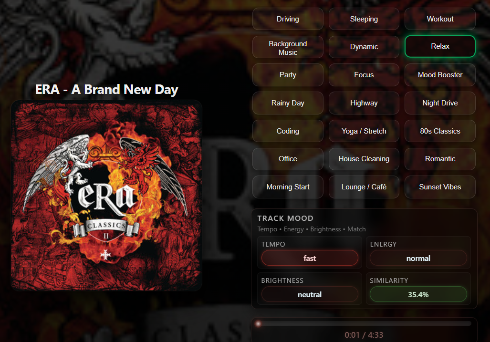
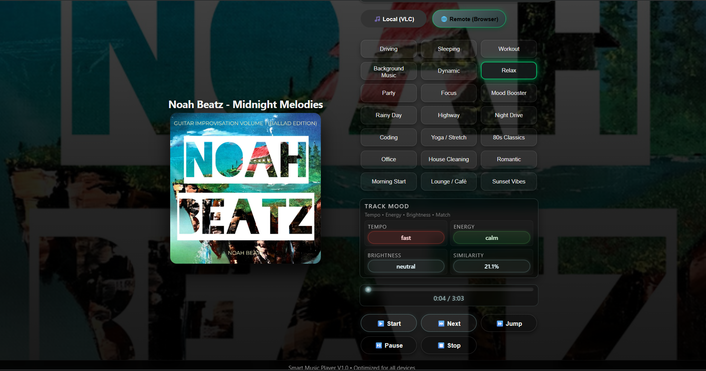
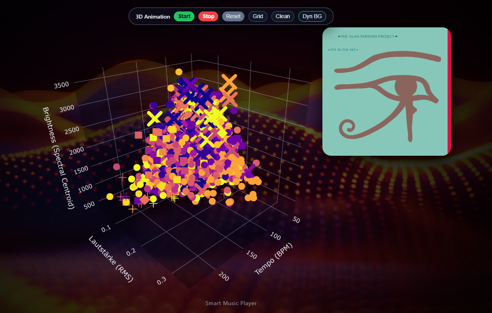
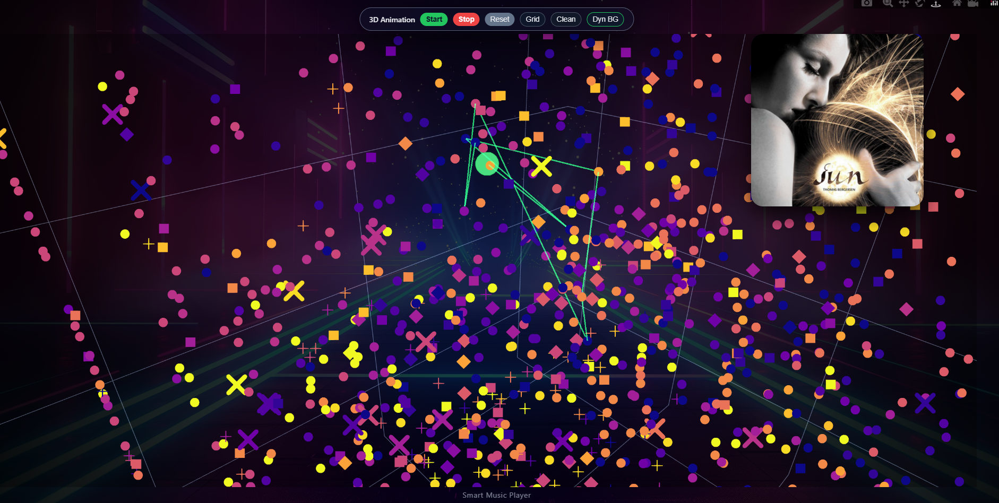

# 🎵 Smart Music Player
### Intelligent Music System with Audio Feature Analysis, Mood Presets, 3D Visualization & Local/Remote Playback

---

## 📌 Overview

The **Smart Music Player** is a fully local, intelligent, web-based music ecosystem designed for Windows and Raspberry Pi.  
It analyzes your entire library, extracts audio features, groups similar songs, generates mood-based playlists, and renders a **3D music universe** directly in the browser.

Playback supports:

- **Local Mode (VLC):** Output directly on the server  
- **Remote Mode (Browser):** MP3 streaming via Flask  
- **Android App Mode:** Optional Android client available  

The server launches using:

```
python3 web_player.py
```

---

## ✨ Key Features

### 🎵 Intelligent Audio Analysis
Powered by **Librosa**, the system extracts:

- Tempo (BPM)  
- RMS Energy  
- Brightness / Spectral Centroid  
- 13 MFCC features  
- K-Means cluster ID (self-learning grouping)

These features are the basis for:

- Mood presets  
- Similarity-based playback  
- 3D visualization  
- Dynamic transitions  

---

### 🎚️ Mood Presets (presets.json)
Up to **20 mood presets**, each with sliders for:

- Tempo  
- Energy  
- Brightness  
- Selectivity (Weight)  

Example:

```json
{
  "id": 1,
  "name": "Driving",
  "tempo": 65,
  "energy": 70,
  "brightness": 60,
  "weight": 0.9
}
```

---

### 🎨 Dynamic UI using Album Art Colors
The system extracts album covers from:

- Embedded ID3 tags  
- `cover.jpg`, `folder.png`, etc.

It then computes dominant colors and applies them to:

- Buttons  
- Bars  
- Background accents  
- Visualizer colors  

---

### 🔊 Three Playback Modes
| Mode | Description |
|------|-------------|
| **Local (VLC)** | Plays on host machine |
| **Remote (Browser)** | Streams MP3 through Flask |
| **Android App** | Optional modern Compose-based Android client |

Autoplay works in all modes.

---

## 🌌 3D Music Universe

The browser renders a **3D scatter plot** where every song is a point defined by:

- **X:** Tempo  
- **Y:** Energy  
- **Z:** Brightness  

Features:

- Click a point → play song  
- Live trail of played songs (green fading path)  
- Dynamic backgrounds (PNG + wave shader)  
- Live color adaption through dominant album art color  
- Camera animations: orbit, dive-in, smooth transitions  

Two background systems:

1. **Static:** 20 PNG backgrounds switching per song  
2. **Dynamic:** Three.js wave-field (particles, fog, spectrum-reactive waves)

---

## 📡 REST API

All features are scriptable via REST:

| Endpoint | Method | Description |
|----------|--------|-------------|
| `/api/status` | GET | Player status |
| `/api/command` | POST | play / pause / next / stop |
| `/api/mode` | GET/POST | switch local/remote |
| `/api/presets` | GET | list presets |
| `/api/preset` | POST | activate preset |
| `/api/stream/<id>` | GET | MP3 stream |
| `/api/cover/<id>` | GET | cover image |
| `/api/play_from_map` | POST | play by 3D click |

---

## 🧠 Architecture

```
music_dirs
   ↓
analyze_and_cluster.py
   ↓ produces
song_features_with_clusters.csv
   ↓
web_player.py (Flask + UI + REST + Visualizer)
```

Tech stack:

- Python 3  
- Flask  
- Librosa  
- Pandas / NumPy  
- Plotly (3D)  
- Three.js (wave shader)  
- VLC (python-vlc)  
- Pillow + Mutagen  
- HTML/CSS/JS  
- Android App (Jetpack Compose)  

---

## 📸 Screenshots

Your repository's `/images` folder contains screenshots tested for:

- Desktop  
- Mobile  
- 3D mode  
- Preset selection  
- Web player  
- Android app  

Example:







---

## 🔧 Installation

### 1. Clone repository
```bash
git clone https://github.com/wolfiru/SmartMusicPlayer
cd SmartMusicPlayer
```

### 2. Install dependencies
```bash
pip install -r requirements.txt
```

### 3. Analyze your music library
```bash
python3 analyze_and_cluster.py
```

### 4. Launch the player
```bash
python3 web_player.py
```

### 5. Open browser:
```
http://localhost:5000
```

---

## 🍓 Raspberry Pi Support
Fully supported on:

- Raspberry Pi 3 / 4  
- Raspberry Pi OS  

Required packages:

```bash
sudo apt update
sudo apt install vlc python3-vlc python3-pil python3-numpy python3-flask
```

---

## 📱 Android App
A full Android Compose application is available:

- Local & remote playback  
- Preset control  
- Cover display & colors  
- Full status syncing  

---

## 📄 License
This project is licensed under the **MIT License**.  
Feel free to use, modify, extend, and share.

---

## 🙌 Credits
Developed by **Wolfgang Ruthner (AT)**  
2025 – Present

A project combining engineering, music analysis, visualization, and creativity.
